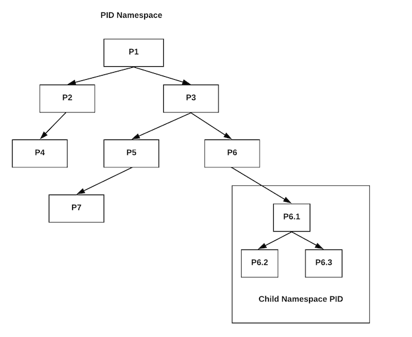
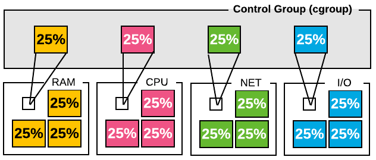
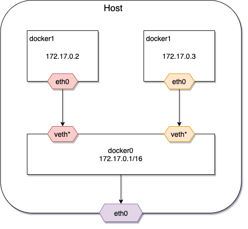

# Docker

Продолжительность: 4 часа, 2 перерыва по 10 минут.

## Целевая аудитория

* Разработчики (backend и frontend);
* QA инженеры;
* Системные Администраторы;
* DevOps.

## Преимущества

После прохождения интенсива вы будете понимать что такое Docker и зачем он нужен. А главное, научитесь с ним работать на
практике.

Интенсив проходит офлайн, вместе с вами будет опытный преподаватель, который ответит на все ваши вопросы и поможет
решить возникающие в процессе проблемы.

## Какие навыки приобретет слушатель после прохождения курса

После прохождения интенсива вы будете понимать что такое Docker, как он устроен внутри, научитесь работать с ним из
консоли и писать свои образы. А так же научитесь писать манифесты для запуска нескольких контейнеров в Docker Compose и
Docker Swarm.

## Лекция

### Предпосылки возникновения оркестрации


#### Традиционная эра развертывания

Раньше приложения запускали на физических серверах, поэтому не было никакого способа определить границы ресурсов для
приложений на физическом сервере, и это вызвало проблемы с распределением ресурсов. Например, если несколько приложений
выполняются на физическом сервере, могут быть случаи, когда одно приложение будет занимать большую часть ресурсов, и в
результате чего другие приложения будут работать хуже. Решением этого было запустить каждое приложение на другом
физическом сервере. Из-за этого приложения не использовали всю мощность серверов, где они запущены, но место в
датацентрах и сами сервера стоили дорого, а значит использование нескольких серверов получалось финансово невыгодно.

#### Эра виртуализации

Решением проблемы экономного использования ресурсов была виртуализация. Она позволила запускать несколько виртуальных
машин (VM) на одном физическом сервере. Виртуализация изолирует приложения между виртуальными машинами и обеспечивает
определенный уровень безопасности, поскольку информация одного приложения не может быть свободно доступна другому
приложению. Виртуализация позволяет лучше использовать ресурсы на физическом сервере и обеспечивает лучшую
масштабируемость, поскольку приложение можно легко добавить или обновить, кроме этого снижаются затраты на оборудование
и многое другое.

Виртуальная машина – полноценна ОС с собственными квотами ресурсов (CPU, память, оборудование), следовательно, каждая VM
тратит ресурсы сервера на обслуживание ОС (около 25%).

#### Эра контейнеризации

Контейнеры похожи на виртуальные машины, но они запущены в рамках одной ОС в user mode и с точки зрения ОС – это обычные
процессы. Подобно виртуальной машине, контейнер имеет свою собственную файловую систему, процессор, память, пространство
процесса и многое другое. Изоляция доступа и квотирование ресурсов достигается с помощью встроенных примитивов ОС
(cgroups и namespaces).

Поскольку они не завязаны на конкретную реализацию ОС, а работают через API вызовы, они переносимы между облаками и
дистрибутивами ОС.

### Архитектура Docker

Docker - это средство виртуализации, одно из назначений которого виртуализация рабочих сред на серверах. Также он
предоставляет универсальный способ доставки приложений на машины (локальный компьютер или удаленные сервера) и их
запуска в изолированном окружении.

Основные понятия:

* Образ (Image) — это read-only шаблон для создания Docker-контейнеров. Представляет собой исполняемый пакет, содержащий
  все необходимое для запуска приложения: код, среду выполнения, библиотеки, переменные окружения и файлы конфигурации.
  Docker-образ состоит из слоев. Каждое изменение записывается в новый слой.
* Контейнер (Container) — запущенный процесс операционной системы в изолированном окружении с подключенной файловой
  системой из образа.

Контейнер — всего лишь обычный процесс операционной системы. Разница лишь в том, что благодаря возможностям ядра, docker
стартует процесс в изолированном окружении. Контейнер видит свой собственный список процессов, свою собственную сеть,
свою собственную файловую систему и т.д. Пока ему не укажут явно, он не может взаимодействовать с вашей основной
операционной системой и всем, что в ней хранится или запущено.

Docker использует архитектуру клиент-сервер: клиент общается с Docker Daemon, который берет на себя задачи
создания, запуска, распределения контейнеров. Клиент и сервер общаются через сокет (по-умолчанию) или через REST API.


Docker Engine — ядро механизма Docker, он отвечает за функционирование и обеспечение связи между основными
объектами:

* серверный процесс-демон `dockerd`: создает и управляет объектами Docker, такими как образы, контейнеры, сети и
  volumes;
* API, через который программы могут взаимодействовать с демоном Docker.
* CLI клиент для Docker.

### Внутреннее устройство Docker

#### Namespaces

Namespaces – это механизм ядра Linux, обеспечивающий изоляцию процессов друг от друга. Включает в себя:

* network – предоставляет контейнеру свое представление сетевого стека (interfaces, routing tables, network devices, и
  т.д.);
* mounts – точки монтирования;
* UTS – Unix Timeshare System, позволяет процессам иметь свои системные идентификаторы hostname и NIS domain name,
  отличные от других контейнеров и host-машины;
* user – изоляция пользователей внутри контейнера;
* IPC – InterProcess Communication, ответственна за изоляцию ресурсов между процессами внутри контейнера.



#### CGroups

Docker использует технологию ядра Linux cgroups (Control Groups), которая изолирует, приоритизирует и выдает квоты на
использование ресурсов системы для группы процессов. С помощью этой технологии контейнеры docker получают только те
ресурсы, которые были ему выделены.



#### Использование Docker в Kubernetes

В Kubernetes для работы с container runtime использует Container Runtime Interface, при этом весь код взаимодействия с
контейнерами выполняется через CRI. Docker не поддерживает CRI напрямую, поэтому kubelet включает компонент под
названием `dockershim`, который транслирует команды из CRI в docker.


Начиная с версии 1.22 Kubernetes отказываются от поддержки `dockershim`, соответственно, Docker и будет работать только
с Container Runtime, поддерживающими Container Runtime Interface (CRI) — `containerd` или `CRI-O`.

Но это не означает, что Kubernetes не сможет запускать контейнеры из Docker образов. И `containerd`, и `CRI-O` могут
запускать образы в формате Docker (фактически в формате OCI), они просто делают это без использования команды docker и
Docker Daemon.


#### Структура образа

Образ состоит из слоев, каждый из которых представляет собой неизменяемую файловую систему, а по-простому набор файлов и
директорий. Образ в целом представляет собой объединенную файловую систему (Union File System), которую можно
рассматривать как результат слияния файловых систем слоев. Объединенная файловая система умеет обрабатывать конфликты,
например, когда в разных слоях присутствуют файлы и директории с одинаковыми именами. Каждый следующий слой добавляет
или удаляет какие-то файлы из предыдущих слоев. В данном контексте _удаляет_ можно рассматривать как _затирает_, т.е.
файл в нижележащем слое остается, но его не будет видно в объединенной файловой системе.

Главное различие между контейнером и образом – это верхний writable-слой. Все операции модификации хранятся в этом слое.
Когда контейнер удаляется, этот слой тоже удаляется, а предыдущие слои не изменяются.


Поскольку у каждого контейнера есть собственный writable-слов, где хранятся все изменения, несколько контейнеров могут
совместно использовать доступ к одному и тому же базовому образу и при этом иметь собственное состояние данных.

```shell
$ docker ps -s
CONTAINER ID   IMAGE                                NAMES                SIZE
85b33aa51fd7   romanowalex/frontend-todo-list:v2.0  frontend-todo-list   643B (virtual 144MB)
de6e26c58235   romanowalex/backend-todo-list:v2.1   backend-todo-list    32.8kB (virtual 536MB)
1b96a3ea4ec2   postgres:15                          postgres             63B (virtual 425MB)

```

* size – объем на диске, который используется для writable-слоя;
* virtual size – объем на диске, который используется для read-only слоев плюс writable-слой.

#### Docker filesystem

OverlayFS сливает два каталога и представляет их как один каталог, эти каталоги называются слоям. OverlayFS обращается к
нижнему каталогу как к _lower_, а к верхнему каталогу — как к _upper_. Унифицированное представление доступно через
собственный каталог, который называется _merged_.

В папке `/var/lib/docker/overlay2` слови представлены папками, в папке `l` хранятся коротки ссылки на папки (_diff_) для
использования в команде mount. В каждом образе хранится (кроме базового, там только _link_ и _diff_):

* _link_ – файл, который содержит короткое имя директории из папки _l_;
* _lower_ – файл, который ссылается на короткое имя родителя;
* _diff_ – директория, которая содержит данные самого образа;
* _merged_ – актуальный контент этого образа (слитый с родительским _diff_);
* _work_ – для внутреннего использования в OverlayFS.


У каждого слоя изображения есть собственный каталог в `/var/lib/docker/overlay/`, который содержит его содержимое.
(LayerID != directory ID)

Начиная с версии Docker 1.10 образы и слои, больше не являются синонимами. Вместо этого образ напрямую ссылается на один
или больше слоев, которые в конечном итоге сливаются в файловую систему контейнера.

Слои теперь идентифицируются hash, который имеет форму `<тип алгоритма>:<hash>`. Значение вычисляется путем применения
алгоритма (sha256) к содержимому слоя. Если содержимое изменится, то вычисленный hash также изменится, а это означает,
что Docker может сверить полученное содержимое слоя с его опубликованным hash, чтобы проверить его содержимое. Слои не
имеют представления о принадлежности к образу, они представляют собой просто наборы файлов и каталогов.

Слои хранятся внутри аналогично образам. Они описываются в каталоге `/lib/docker/image/overlay2/layerdb/sha256/` и
содержат связку между directory ID и LayerID. Каждая из директорий содержит следующие файлы:

* _diff_ – содержит hash слоя (может не совпадать с именем директории);
* _size_ – физический размер слоя;
* _cache-id_ – содержит directory ID.

```shell
$ vagrant up
$ ssh ansible@192.168.56.100

$ curl -fsSL https://download.docker.com/linux/ubuntu/gpg | sudo apt-key add -
$ sudo add-apt-repository "deb [arch=amd64] https://download.docker.com/linux/ubuntu focal stable"
$ sudo apt-get update
$ sudo apt-get install -y jq docker-ce docker-ce-cli containerd.io docker-compose-plugin

$ sudo usermod -aG docker ansible

$ ssh ansible@192.168.56.100

$ docker run hello-world

$ wget -O /tmp/dive.deb https://github.com/wagoodman/dive/releases/download/v0.12.0/dive_0.12.0_linux_amd64.deb
$ sudo apt install /tmp/dive.deb

$ docker pull postgres:15-alpine

$ docker image inspect --format "{{json .RootFS.Layers}}" postgres:15-alpine | jq
[
  "sha256:994393dc58e7931862558d06e46aa2bb17487044f670f310dffe1d24e4d1eec7",
  "sha256:c107d84c5ee5434184266dd999ba59186dbe34ef4c6d1464f2ddd742f5eaa7f8",
  "sha256:1191ff7875541dfd09e2f07b69b294d01cae17d396860e2d255308cb4ee9de5f",
  "sha256:cd27e8fe70814af54c1320fcb6f9395589188c1af202d784dc09fd2fe0c5d9ec",
  "sha256:a1d3de8ff553b04e12df7068c99d824a9f860947d306feee9200a14127fd9a0b",
  "sha256:c299f2771a0f2ac5f22deb1008c32c58fef5fa24bb11ed5a23b63def5887b798",
  "sha256:e90d97e0fb0c12656fa4a7f9629c28d53065d2478a1dcbe79ae7b5eb0eb53e8e",
  "sha256:86565deff7509eb519ca0cce06484f6d6dcdabd50c2b3995768c27cccc1301c9"
]

# Данные лежат в слоев лежат в /var/lib/docker/overlay2/
$ ls -l /var/lib/docker/overlay2/
drwx--x--- 4 root root 4.0K Nov  5 20:42 1a2482afeba6d95a6d6dfd3d6a22bfdfddca75595c9df597b55dd76823873c33/
drwx--x--- 4 root root 4.0K Nov  5 20:42 1a2482afeba6d95a6d6dfd3d6a22bfdfddca75595c9df597b55dd76823873c33-init/
drwx--x--- 4 root root 4.0K Nov  5 20:43 3030da422b0e202b27ef1dacbcb9cfc16bb737573e8d30e1d3b4a2e7dc9b101c/
drwx--x--- 4 root root 4.0K Nov  5 20:43 3030da422b0e202b27ef1dacbcb9cfc16bb737573e8d30e1d3b4a2e7dc9b101c-init/
drwx--x--- 4 root root 4.0K Nov  6 05:55 56eea650bd4855676c0c57405d351bcfa804704317ee503308150eaabaad3a34/
drwx--x--- 4 root root 4.0K Nov  5 21:07 56eea650bd4855676c0c57405d351bcfa804704317ee503308150eaabaad3a34-init/
drwx--x--- 4 root root 4.0K Nov  5 21:01 731c1ef12f136de868b6c76fd3b6a3e055ac5f3817516927a1f389ee88d93a0e/
drwx--x--- 4 root root 4.0K Nov  5 21:01 873a8c55cf4f368f397889035599c1b5fbe87dd48bb3cead653f73ed5305959b/
drwx--x--- 4 root root 4.0K Nov  5 21:05 969c6ca1a5d0caf4aab84d89de31a4dd017f27be18adea13db70c6e480efc3cb/
drwx--x--- 3 root root 4.0K Nov  5 21:01 9e6909cf6f857a19e27ca5e054dbfbd8c3d26f861e88213c4c697b3db9d4fd8f/
drwx--x--- 4 root root 4.0K Nov  5 21:01 ab11108080f9d6f64382bc8969e27fa37f3dc523c9b66b0e15ab9c3be2c19671/
drwx--x--- 4 root root 4.0K Nov  5 21:01 c6916816315ab081b673254e528ff02decb8111b88eacd4a118cf856ab47e281/
drwx--x--- 3 root root 4.0K Nov  5 20:42 d3d6fbdac894d1c6b038bc4141b4bfbc46a54b6da16f79f198b14b11286234dc/
drwx--x--- 4 root root 4.0K Nov  5 21:01 d8ce16555aa3ffa154c7b84f99138cbde317f447f3fde3289f5045a3490498dc/
drwx--x--- 4 root root 4.0K Nov  5 21:05 e5ae3537d4efe5213b6677bbeb6f6b3c4c4106d66f95546794dbc2b5456e79b6/
drwx--x--- 4 root root 4.0K Nov  5 21:05 e5ae3537d4efe5213b6677bbeb6f6b3c4c4106d66f95546794dbc2b5456e79b6-init/
drwx--x--- 4 root root 4.0K Nov  5 21:01 ee3adbd629acc5fc5bbd69bd968862f9f8bcb3e5627436d6925b287a354f19d3/
drwx------ 2 root root 4.0K Nov  5 21:08 l/

# в папке l хранятся коротки ссылки на папки (diff) для использования в команде mount
$ ls -l /var/lib/docker/overlay2/l/
lrwxrwxrwx 1 root root 72 Nov  5 21:01 2V5VOYBYTBNSA2LGE3UMSOR7KL -> ../ab11108080f9d6f64382bc8969e27fa37f3dc523c9b66b0e15ab9c3be2c19671/diff/
lrwxrwxrwx 1 root root 72 Nov  5 21:01 5BC5KJ4XT3Z25IMQVCLEULG5XT -> ../c6916816315ab081b673254e528ff02decb8111b88eacd4a118cf856ab47e281/diff/
lrwxrwxrwx 1 root root 72 Nov  5 21:05 CD5DVCWGE6R4XFPPQASG5JXSR4 -> ../e5ae3537d4efe5213b6677bbeb6f6b3c4c4106d66f95546794dbc2b5456e79b6/diff/
lrwxrwxrwx 1 root root 77 Nov  5 20:43 EGOL3MVQVAQHO5VN5LPFWTICCU -> ../3030da422b0e202b27ef1dacbcb9cfc16bb737573e8d30e1d3b4a2e7dc9b101c-init/diff/
lrwxrwxrwx 1 root root 72 Nov  5 21:01 GV2ZGRDPJPTPDWPETTXTBGHPLB -> ../9e6909cf6f857a19e27ca5e054dbfbd8c3d26f861e88213c4c697b3db9d4fd8f/diff/
lrwxrwxrwx 1 root root 72 Nov  5 21:01 HJ4S43EUDKOXIKA4UPJYW5FW4B -> ../ee3adbd629acc5fc5bbd69bd968862f9f8bcb3e5627436d6925b287a354f19d3/diff/
lrwxrwxrwx 1 root root 72 Nov  5 21:01 IJUGCX5ETVC2DLOUJZLVT44QFI -> ../731c1ef12f136de868b6c76fd3b6a3e055ac5f3817516927a1f389ee88d93a0e/diff/
lrwxrwxrwx 1 root root 72 Nov  5 21:01 KPG2WP2WSKTRNZZICBTZJGNDZ4 -> ../d8ce16555aa3ffa154c7b84f99138cbde317f447f3fde3289f5045a3490498dc/diff/
lrwxrwxrwx 1 root root 72 Nov  5 20:42 Q332M2GWS72CS3PAV5T62RHEMK -> ../d3d6fbdac894d1c6b038bc4141b4bfbc46a54b6da16f79f198b14b11286234dc/diff/
lrwxrwxrwx 1 root root 77 Nov  5 21:07 R7AIIRLLWCQRG77JZAGVC73U77 -> ../56eea650bd4855676c0c57405d351bcfa804704317ee503308150eaabaad3a34-init/diff/
lrwxrwxrwx 1 root root 72 Nov  5 21:01 RPJLXSMMDMKUNBYIRDG72BXX6E -> ../873a8c55cf4f368f397889035599c1b5fbe87dd48bb3cead653f73ed5305959b/diff/
lrwxrwxrwx 1 root root 77 Nov  5 21:05 RS4ISVS5WKY6U4Y2YYTNRS43RO -> ../e5ae3537d4efe5213b6677bbeb6f6b3c4c4106d66f95546794dbc2b5456e79b6-init/diff/
lrwxrwxrwx 1 root root 72 Nov  5 21:07 S63HBRFNHNFMRAPOKGCGHP67OP -> ../56eea650bd4855676c0c57405d351bcfa804704317ee503308150eaabaad3a34/diff/
lrwxrwxrwx 1 root root 77 Nov  5 20:42 SPLVF4QNHKGJMGGGNMOLIDSZLS -> ../1a2482afeba6d95a6d6dfd3d6a22bfdfddca75595c9df597b55dd76823873c33-init/diff/
lrwxrwxrwx 1 root root 72 Nov  5 20:43 TWD5VJVTPWLAOITTZVWT3XQBHS -> ../3030da422b0e202b27ef1dacbcb9cfc16bb737573e8d30e1d3b4a2e7dc9b101c/diff/
lrwxrwxrwx 1 root root 72 Nov  5 20:42 VCAQCPQMQJI5ME6462LM5SASIY -> ../1a2482afeba6d95a6d6dfd3d6a22bfdfddca75595c9df597b55dd76823873c33/diff/
lrwxrwxrwx 1 root root 72 Nov  5 21:01 Y4GTDIJ5VVUDIO2JO4SX2U6PG2 -> ../969c6ca1a5d0caf4aab84d89de31a4dd017f27be18adea13db70c6e480efc3cb/diff/

# LayerID не равен directory ID, их связка (sha256) хранится в /var/lib/docker/image/overlay2/layerdb/sha256/
$ ls -al /var/lib/docker/image/overlay2/layerdb/sha256/
drwx------  2 root root 4096 Nov  5 21:01 070c03fccb2906f60ec43569980287814802f7d0b2d3dcc714bc5ef1c86f373a/
drwx------  2 root root 4096 Nov  5 21:01 12ecc7f7b876721f4d958e20fc3c1c7d9227508c62d903ade63e199f0f0280ce/
drwx------  2 root root 4096 Nov  5 21:01 4dab68415bc6bc7655ecb95fb07e1d593903fc053820b165a9f36d3711f02806/
drwx------  2 root root 4096 Nov  5 21:01 88af384590de04a47b9b659583ea4852f8a6cfae0660b2985f64fa3296b4c400/
drwx------  2 root root 4096 Nov  5 21:01 8b92637bd54864bdd672e0b4f90143663aec23aa25a8265391d039c39efcf30f/
drwx------  2 root root 4096 Nov  5 21:01 934d24deeb153a2ca4f24035b3b9aeb42b265108a35ca74d52782fe84ff031d1/
drwx------  2 root root 4096 Nov  5 21:01 994393dc58e7931862558d06e46aa2bb17487044f670f310dffe1d24e4d1eec7/
drwx------  2 root root 4096 Nov  5 21:01 ad2999dcc3a48c967d0d5a498b564c3c93bb2c45c5403d70d42fe763283d13c4/
drwx------  2 root root 4096 Nov  5 20:42 e07ee1baac5fae6a26f30cabfe54a36d3402f96afda318fe0a96cec4ca393359/

# ищем слой 86565deff, где хранится docker-entrypoint.sh:
# * в diff хранится sha слоя;
# * в cache-id хранится папка /var/lib/docker/overlay2/.
$ grep -RI '86565deff7509eb519ca0cce06484f6d6dcdabd50c2b3995768c27cccc1301c9' .
./4dab68415bc6bc7655ecb95fb07e1d593903fc053820b165a9f36d3711f02806/diff:sha256:86565deff7509eb519ca0cce06484f6d6dcdabd50c2b3995768c27cccc1301c9

$ cd 4dab68415bc6bc7655ecb95fb07e1d593903fc053820b165a9f36d3711f02806/

$ ls -l
-rw-r--r-- 1 root root  64 Nov  5 21:01 cache-id
-rw-r--r-- 1 root root  71 Nov  5 21:01 diff
-rw-r--r-- 1 root root  71 Nov  5 21:01 parent
-rw-r--r-- 1 root root   5 Nov  5 21:01 size

$ cat diff
sha256:86565deff7509eb519ca0cce06484f6d6dcdabd50c2b3995768c27cccc1301c9

$ cat cache-id
969c6ca1a5d0caf4aab84d89de31a4dd017f27be18adea13db70c6e480efc3cb

$ cd /var/lib/docker/overlay2/969c6ca1a5d0caf4aab84d89de31a4dd017f27be18adea13db70c6e480efc3cb

$ ls -l
-rw------- 1 root root    0 Nov  5 21:07 committed
drwxr-xr-x 3 root root 4.0K Nov  5 21:01 diff/
-rw-r--r-- 1 root root   26 Nov  5 21:01 link
-rw-r--r-- 1 root root  202 Nov  5 21:01 lower
drwx------ 2 root root 4.0K Nov  5 21:01 work/

$ ls -al diff/usr/local/bin/
-rwxrwxr-x 1 root root 12K Oct  7 01:17 docker-entrypoint.sh*
```

Для просмотра слоев контейнера удобно использовать утилиту [dive](https://github.com/wagoodman/dive).

### Основные команды Docker CLI

```shell
# установка подсказок для командной строки
docker completion fish > ~/.config/fish/completions/docker.fish

# сборка образа ping в папке example/
$ docker build examples/ -t my-ping:v1.0

# запуск контейнера
$ docker run --name my-ping my-ping:v1.0

# запуск контейнера с аргументами
$ docker run --name my-ping -d my-ping:v1.0 ya.ru

# вывод логов контейнера
$ docker logs -f my-ping

# остановка, старт и рестарт контейнера
$ docker stop --time=2 my-ping
$ docker start my-ping
$ docker restart --time=2 my-ping

# вывод всех образов
$ docker images

# просмотр запущенных контейнеров
$ docker ps

# просмотр всех контейнеров
$ docker ps -a

# просмотр всех сведение о контейнере
$ docker inspect my-ping

# получение внутреннего ip-адреса контейнера
$ docker inspect --format='{{range .NetworkSettings.Networks}}{{.IPAddress}}{{end}}' my-ping

# получение пути к папке с логами контейнера
$ docker inspect --format='{{.LogPath}}' my-ping

# получение информации об используемом образе
$ docker inspect --format='{{.Config.Image}}' my-ping

# заход внутрь образа
$ docker exec -it my-ping /bin/bash

# показать запущенные процессы в контейнере
$ docker top my-ping

# информация о потребляемых ресурсах docker
$ docker stats

# удаление контейнера postgres
$ docker rm -f my-ping

# удаление образа my-ping:v1.0
$ docker rmi my-ping:v1.0

# запустить контейнер postgres:15 на порту 5432 и создать пользователя test:test и базу example
$ docker run \
    --name postgres \
    -p 5432:5432 \
    -e POSTGRES_USER=test \
    -e POSTGRES_PASSWORD=test \
    -e POSTGRES_DB=services \
    postgres:15
```

### Оптимизация размера образа

Образ — это не что иное, как коллекция других образов, можно прийти к очевидному выводу: размер образа равен сумме
размеров образов, его составляющих.

```shell
$ docker history my-ping:v1.0
IMAGE          CREATED        CREATED BY                                      SIZE      COMMENT
be17399a7548   10 days ago    CMD ["google.com"]                              0B        buildkit.dockerfile.v0
<missing>      10 days ago    ENTRYPOINT ["/bin/ping"]                        0B        buildkit.dockerfile.v0
<missing>      10 days ago    RUN /bin/sh -c apt-get update     && apt-get…   59.3MB    buildkit.dockerfile.v0
<missing>      8 months ago   /bin/sh -c #(nop)  CMD ["/bin/bash"]            0B
<missing>      8 months ago   /bin/sh -c #(nop) ADD file:63d5ab3ef0aab308c…   77.8MB
<missing>      8 months ago   /bin/sh -c #(nop)  LABEL org.opencontainers.…   0B
<missing>      8 months ago   /bin/sh -c #(nop)  LABEL org.opencontainers.…   0B
<missing>      8 months ago   /bin/sh -c #(nop)  ARG LAUNCHPAD_BUILD_ARCH     0B
<missing>      8 months ago   /bin/sh -c #(nop)  ARG RELEASE                  0B

```

Каждая дополнительная инструкция в Dockerfile будет только увеличивать общий размер образа. Соответственно, чтобы
уменьшить результирующий размер образа:

* нужно объединять однотипные команды;
* использовать максимально компактный базовый образ, например на базе [Alpine Linux](https://hub.docker.com/_/alpine);
* использовать multistage build, чтобы не тащить в результирующий образ лишнее.
* использовать `.dockerignore`, чтобы исключить лишние файлы из сборки (синтаксис аналогичен .gitignore).

### Volumes

Для хранения данных между перезапусками контейнеров используется абстракция, называемая volume.

Для подключения конфигурационных файлов или добавления информации внутрь контейнера можно примонтировать папку с
host-машины: `--volume $(pwd)/postgres:/docker-entrypoint-initdb.d/`.

Для персистентного хранения данных лучше создать Volume и примонтировать его при запуске
контейнера `--volume pg-data:/var/lib/postgresql/data`.

```shell
$ docker volume create pg-data
$ docker volume ls
local     pg-data

$ docker volume inspect pg-data
[
    {
        "CreatedAt": "2024-06-13T20:17:12Z",
        "Driver": "local",
        "Labels": {},
        "Mountpoint": "/var/lib/docker/volumes/pg-data/_data",
        "Name": "pg-data",
        "Options": {},
        "Scope": "local"
    }
]

$ docker run -d \
    --name postgres \
    -p 5432:5432 \
    -e POSTGRES_USER=program \
    -e POSTGRES_PASSWORD=test \
    -e POSTGRES_DB=services \
    --volume pg-data:/var/lib/postgresql/data \
    postgres:15

$ psql -h localhost -p 5432 -U program services
>> CREATE TABLE items (id SERIAL PRIMARY KEY, name VARCHAR NOT NULL);
>> INSERT INTO items(name) VALUES ('test');

$ docker rm -f postgres
$ docker run -d \
    --name postgres \
    -p 5432:5432 \
    -e POSTGRES_USER=program \
    -e POSTGRES_PASSWORD=test \
    -e POSTGRES_DB=services \
    --volume pg-data:/var/lib/postgresql/data \
    postgres:15

$ psql -h localhost -p 5432 -U program services
>> SELECT * FROM items;
 id | name
----+------
  1 | test
(1 row)

```

### Структура Dockerfile

```dockerfile
# Указывает с какого образаа брать сборку.
FROM ubuntu:20.04

# Указывает от какого пользоватя (и опционально группы) запускаются дальнейшие команды.
USER ronin:staff

# Информирует что образ слушает порт 8080 по протоколу tcp.
EXPOSE 8080/tcp

# Указывает из какой директории выполнять дальнейшие инструкции.
# Если указан относительный путь, он будет применяться относительно предыдущих инструкций WORKDIR.
WORKDIR application

# Определяет перменную, оторую пользователь может передать при запуске `docker build --build-arg <varname>=<value>`.
ARG PROFILE=docker

# Копирует файлы с host-машины в образ, доступны wildcards, --chmod user:user.
# ADD умеет распаковывать архивы, но в документации советуют использовать COPY, где магия ADD не требуется.
ADD https://github.com/Netflix/eureka/archive/refs/tags/v1.10.17.zip /app/eureka
COPY build/libs/order-service.jar /app/order-service.jar

# Задает переменные окружения. Переменная окружения будет определена для запущенного контейнера
ENV SPRING_PROFILES_ACTIVE=$PROFILE

# выполняет каждую команду в новом слое поверх текущего слоя.
RUN apt-get update && \
  apt-get install openjdk-17-jdk -y

# Позволяет описывать контейнер как исполняемый.
# * ENTRYPOINT описывает команду, которая всегда будет выполняться при старте контейнера;
# * CMD определяет аргументы, которые будут переданы в ENTRYPOINT.
ENTRYPOINT ["/bin/ping"]
CMD ["google.com"]
```

Если во время выполнения определена только одна из инструкций, то и `CMD` и `ENTRYPOINT` будут иметь одинаковый эффект.

`ENTRYPOINT` имеет два режима выполнения:

* `ENTRYPOINT` ["/bin/ping", "localhost"] (_exec_, предпочтительно);
* `ENTRYPOINT /bin/ping localhost` (_shell_).

Режим exec является рекомендуемым. Это связано с тем, что контейнеры задуманы так, чтобы содержать один процесс.
Например, отправленные в контейнер сигналы перенаправляются процессу, запущенному внутри контейнера с идентификатором
`PID == 1`.

Но в режиме _exec_ нельзя воспользоваться переменными среды (`$PATH` и т.п.), поэтому нужно писать полные пути к
исполняемым файлам.

Аргументы `CMD` присоединяются к концу инструкции `ENTRYPOINT`:

* Если вы используете режим _shell_ для `ENTRYPOINT`, `CMD` игнорируется.
* При использовании режима _exec_ для `ENTRYPOINT` аргументы `CMD` добавляются в конце.
* При использовании _режима_ exec для инструкции `ENTRYPOINT` необходимо использовать режим _exec_ и для
  инструкции `CMD`.

### Health Check

Инструкция `HEALTHCHECK` сообщает Docker, как протестировать контейнер, чтобы убедиться, что он работает.

* `interval` – интервал между проверками (когда предыдущая проверка закончилась);
* `timeout` – таймаут, после которого проверка считается неудачной;
* `start-period` – время на инициализацию контейнера, проверки, которые неудачно завершились за этот период не
  учитываются в общем количестве попыток.
* `retries` – количество попыток, прежде чем пометить контейнер как `unhealthy`. Если при запуске указан
  флаг `--restart on-failure|always|uless-stopped`, то контейнер будет перезапущен.

Без указания `HEALTHCHECK` Docker ориентируется по ненулевому exit code контейнера.

### Взаимодействие контейнеров по сети

При запуске Docker процесса, он создает новый виртуального интерфейс типа bridge с названием `docker0` в host-системе.
Этот интерфейс позволяет docker создать виртуальную подсеть для использования контейнерами, которые он будет запускать.
Мост будет служить основной точкой взаимодействия между сетью внутри контейнера и сетью хоста.

Когда Docker запускает контейнер, создается новый виртуальный интерфейс и ему назначается адрес в диапазоне подсети
моста. IP-адрес связан с внутренней сетью контейнера, предоставляя путь для сети контейнера к мосту `docker0` на системе
хоста. Docker автоматически конфигурирует правила в `iptables` для обеспечения переадресации и конфигурирует NAT для
трафика из `docker0` во внешнюю сеть.



#### Проброс портов

* Открытие порта (`EXPOSE`) информирует docker, что данный порт используется контейнером. Эта информация, например,
  доступна в `docker inspect --format '{{json .NetworkSettings.Ports }}' <container>`.
* Публикация порта (`-p 8080:8080`) пробрасывает порт на интерфейс хоста, делая его доступным для внешнего мира.

#### Коммуникация между контейнерами

Для взаимодействия между контейнерами нужно создать между ними сеть. Есть несколько основных видов сетей:

* `bridge` – сеть типа мост для взаимодействия между контейнерами.
    * По-умолчанию, docker создает дефолтную `bridge` сеть между всеми контейнерами, но она не предоставляет resolv DNS,
      соответственно, общение между контейнерами требуется выполнять с помощью ip-адресов (`--link` deprecated).
    * Если создается user-defined сеть, то внутри можно обращаться по имени контейнера (DNS resolution).
* `host` – монтируется на сеть host-машины, порты внутри контейнера аллоцируются сразу на host машине. Работает только
  на Linux и не поддерживается Docker for Desktop for Mac, Docker Desktop for Windows.
* `macvlan` – docker host принимает запросы на несколько MAC-адресов по своему ip-адресу и направляют эти запросы в
  соответствующий контейнер.
* `overlay` – создает покрывающую сеть между несколькими машинами с docker. Используется в Kubernetes.

Дефолтная `bridge` сеть имеет ряд существенных недостатков, поэтому для взаимодействия контейнеров стоит всегда
создавать отдельные сети, включающие только необходимые контейнеры. Контейнеры могут подключаться и отключаться от сети
на лету.

```shell
$ docker pull romanowalex/echo-server:v2.0

$ docker network create --driver bridge common

$ docker network ls
NETWORK ID     NAME      DRIVER    SCOPE
58a6e614b3a8   bridge                bridge    local
590e8b94c17e   host                  host      local
023f4b24772f   none                  null      local
340fa41db593   common      bridge    local

# запускаем server-1 на порту 8081
$ docker run -d \
  -p 8081:8080 \
  --network common \
  --name server-1 \
  romanowalex/echo-server:v2.0

# запускаем server-2 на порту 8082
$ docker run -d \
  -p 8082:8080 \
  --network common \
  --name server-2 \
  romanowalex/echo-server:v2.0

$ docker inspect -f "{{json .NetworkSettings.Networks }}" server-1 | jq
{
  "common": {
    "Aliases": [
      "5b979ce14143"
    ],
    "Gateway": "172.23.0.1",
    "IPAddress": "172.23.0.2",
    "IPPrefixLen": 16,
    "MacAddress": "02:42:ac:17:00:02",
  }
}

# запускаем логи server-1
$ docker logs -f server-1

# заходим внутрь образа server-2
$ docker exec -it server-2 /bin/bash

# выполняем запрос к server-1
$ curl -X POST http://server-1:8080 -d 'message="Hello from server-2"'

```

### Пример

```shell
$ docker volume create pg-data
$ docker network create --driver bridge common

$ docker run -d \
    --name postgres \
    -p 5432:5432 \
    -e POSTGRES_USER=postgres \
    -e POSTGRES_PASSWORD=postgres \
    -e POSTGRES_DB=services \
    --network common \
    --volume pg-data:/var/lib/postgresql/data \
    --volume $(pwd)/postgres:/docker-entrypoint-initdb.d/ \
    postgres:15

$ docker run -d \
    --name backend-todo-list \
    --network common \
    -e SPRING_PROFILES_ACTIVE=docker \
    -e OAUTH2_SECURITY_ENABLED=false \
    romanowalex/backend-todo-list:v2.1

$ docker run -d \
    -p 3000:80 \
    --name frontend-todo-list \
    --network common \
    -e BACKEND_HOST=backend-todo-list \
    romanowalex/frontend-todo-list:v2.0
```

Приложение доступно по адресу [localhost:3000](http://localhost:3000).

### Docker Compose

Docker Compose — это инструментальное средство, входящее в состав Docker. Оно предназначено для решения задач, связанных
с развёртыванием проектов. Технология Docker Compose, позволяет, с помощью одной команды, запускать множество сервисов.

Docker применяется для управления отдельными контейнерами (сервисами), из которых состоит приложение.

Docker Compose используется для одновременного управления несколькими контейнерами, входящими в состав приложения. Этот
инструмент предлагает те же возможности, что и Docker, но позволяет работать с более сложными приложениями.

Docker Compose по умолчанию создает `bridge` между контейнерами, соответственно docker поднимает DNS resolve и
контейнеры могут общаться друг к другу по имени.

[Docker Compose](examples/docker-compose.yml)

```shell
# сборка docker образов (если прописан блок build)
$ docker compose build

# публикация docker в Container Registry (в имени образа прописывается namespace)
$ docker compose push

# запуск всех образов
$ docker compose up -d --wait
[+] Running 4/5
 ⠿ Network examples_default      Created                       0.0s
 ⠿ Volume "examples_db-data"     Created                       0.0s
 ⠿ Container postgres            Healthy                       11.0s
 ⠿ Container backend-todo-list   Waiting                       20.4s
 ⠿ Container frontend-todo-list  Created                       32.5s

# остановка, старт и рестарт сервисов
$ docker compose start/stop/restart

# остановка всех сервисов и удаление volume
$ docker compose down --volumes
[+] Running 3/3
 ⠿ Container simple-frontend  Removed                                                                                                                                                     0.2s
 ⠿ Container simple-backend   Removed                                                                                                                                                     0.3s
 ⠿ Network examples_default   Removed

# просмотр какой порт проброшен наружу для порта 80 внутри контейнера
$ docker compose port frontend-todo-list 80
0.0.0.0:80
```

### Docker Swarm

### Ссылки

1. [Сети Docker изнутри: как Docker использует iptables и интерфейсы Linux](https://habr.com/ru/articles/333874/)
